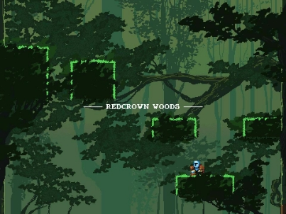
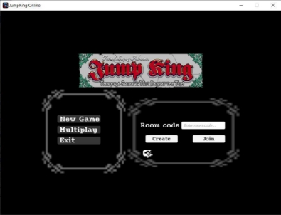
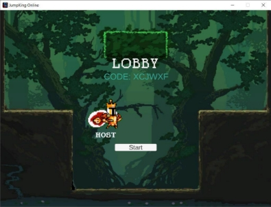
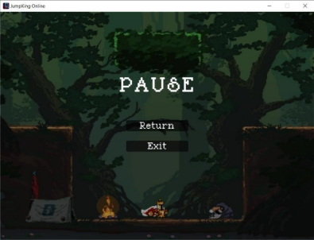
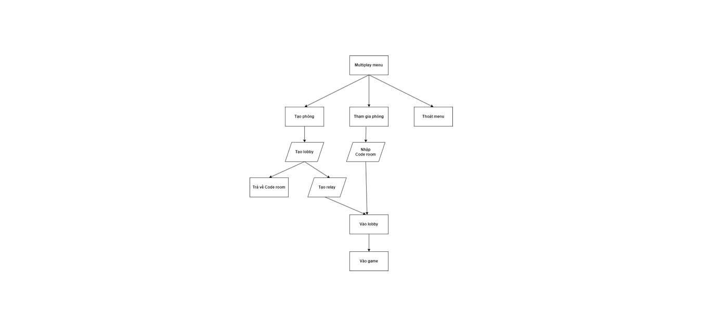
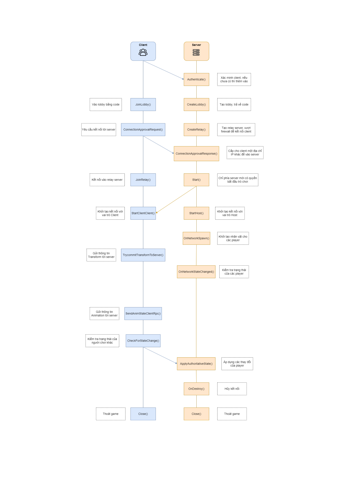

# NT106-Project

Đồ án lập trình mạng căn bản UIT

## Description

Jumpking online with Unity

### 1. **Giới thiệu về trò chơi** 

- **Nhân vật:** King và Knight.** 

*Figure 1: Knight character* 

*Figure 2: King character* 

- **Bản đồ:** Redcrow Woods.** 

*Figure 3: Redcrow Woods map* 

### 2. **Gameplay**  

- Số lượng người chơi trong một phòng: 2. 
- Sau khi nhập mã phòng, người chơi sẽ được đưa vào lobby, host sẽ có quyền bắt đầu trò chơi. 
- Khi vào game, người chơi sẽ được spawn vào bản đồ game. 
- Bản đồ sẽ bao gồm:  
  - Block. 
  - Building object. 
  - Npc. 
- Người chơi nào lên được đỉnh tháp trước sẽ là người chiến thắng. 

### 3. **Tính năng** 

- Tạo phòng chơi với số lượng người chơi là 2 (1 host). 
- Tham gia phòng chơi bằng code (1 client). 
- Tạo lobby, relay.  
- Tạm dừng game. 

**Một số hình ảnh minh họa:**  

*Figure 4: Create and Join game room* 

*Figure 5: Game lobby* 

*Figure 6: Pause game* 

### 4. **Mô hình phân rã chức năng (BFD)** 

*Figure 7: Game BFD* 

### 5. **Cấu trúc gói tin** 

- **Thư viện:** *Unity Netcode*, *Unity Relay*, *Unity Lobby* 
- **Chức năng:**  

  - Đồng bộ vị trí *Player*. 
  - Đồng bộ *Animation*.
  - Tạo kết nối.
  - Tạo phòng chờ.
  - Kết nối *Player* vào *Server* thông qua *Unity Services* (Global Hosting).

**Client đến Server** 

|**Control Message:**  Connect/Disconnect/Data/ |**Length:** 6144 bytes |
| :- | - |
|**Sender:** Client** |**Receiver:** Server** |
|**Body** ||

|**Packet** |||||
| - | :- | :- | :- | :- |
|NetworkObjectId |Position |Rotation |Scale |State |

*Source: NetworkObject.cs* 

- **Giải nghĩa**: 

  - *Connect*: người chơi yêu cầu kết nối vào Server. 
  - *Disconnect*: người chơi yêu cầu rời Server. 
  - *Data*: người chơi gửi thông tin trong Packet. 
  - *NetworkObjectId*: Id của người chơi. 
  - *Position*: Vị trí người chơi hiện tại. 
  - *Rotation*: Trạng thái xoay của người chơi, cố định giá trị (0,0,0). 
  - *Scale*: Trạng thái lật của người chơi, di chuyển sang phải (1,1,1), di chuyển sang phải (-1,1,1). 
  - *State*: hoạt ảnh hiện tại, gồm 5 hoạt ảnh {idle, run, hold, jump, fall}. 

**Server đến Client**  

|**Control Message:**  IsServer/IsClient/IsListening/ IsApproved |**Length:** 6144 bytes |
| :-: | - |
|**Sender:** Server |**Receiver:** Client |
|**Body** ||

|**Packet** ||||
| - | :- | :- | :- |
|LocalClientId |NetworkPrefabs |NetworkTransform |NetworkAnimator |

- **Giải nghĩa:** 

  - *IsServer*: kiểm tra xem có phải là Server. 
  - *IsClient*: kiểm tra nếu là người chơi. 
    - Trong đồ án này, Host sẽ là Server đồng thời cũng là Client. 
  - *IsListening*: kiểm tra xem Server có đang mở kết nối. 
  - *IsApproved*: kiểm tra người chơi có được chấp nhận. 
  - *LocalClientId*: Id của người chơi, được cấp bởi Server thông qua NetworkObjectId. 
  - *NetworkPrefabs*: Nhân vật của người chơi. 
  - *NetworkTransform*: Vị trí người chơi được trả về, bao gồm: 
    - *Position* 
    - *Rotation* 
    - *Scale* 
  - *NetworkAnimator*: Hoạt ảnh nhân vật được trả về, bao gồm: 
    - *Sprite* 
    - *Animation* 
  - Đối với mỗi lần gửi, Server sẽ gửi cho (n – 1) gói tin cho (n) người chơi.  

### 6. **Network stack**  

### 7. **Phân chia công việc** 

|**MSSV** |**Họ tên** |**Công việc** |**% Công việc** |
| - | - | - | - |
|21522797 |Lê Huỳnh Quang Vũ |
- Thiết kế gameplay, lập trình logic game. 

- Thiết kế mạng, lập trình mạng. 

- Thuyết trình. 

- Làm báo báo. 
|100% |

***Video demo*: [NT106 - Đồ Án - Jumpking Online - Nhóm 02 - YouTube](https://www.youtube.com/watch?v=lYw9zh475dY)**
